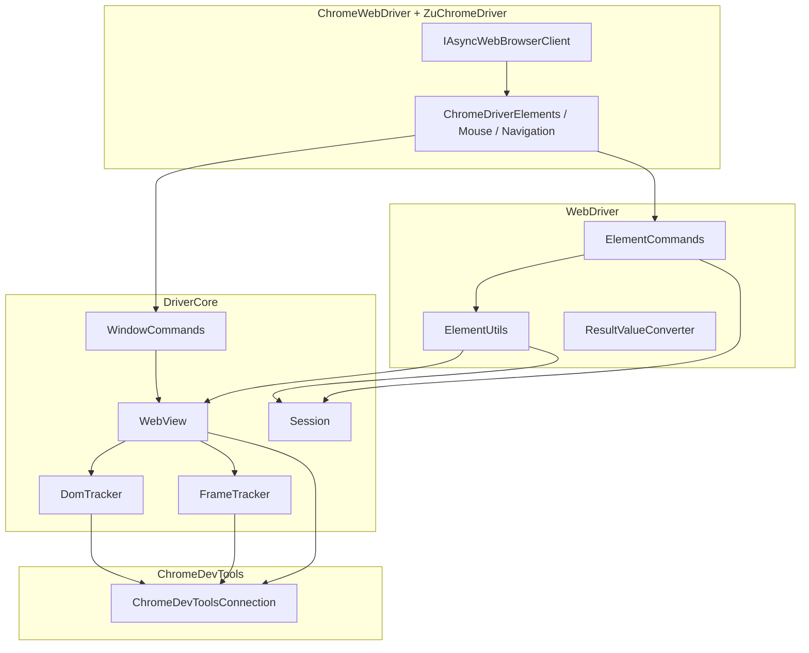

# Architecture: DriverCore

The `ZuChromeDriver/DriverCore/` directory implements the **page-level automation core**: session state, frame/DOM tracking, CDP script bridge, and chromedriver atoms.

Namespace: **`Zu.Chrome.DriverCore`**.

Element-level commands (`ElementCommands`, `ElementUtils`, `ResultValueConverter`, `JsonValueHelper`, `ElementKeys`) live in **`WebDriver/`** (`Zu.WebDriver`), not in DriverCore. See [ARCHITECTURE-WebDriver-Layer.md](ARCHITECTURE-WebDriver-Layer.md).

## Role in the stack

**DriverCore** is not CDP transport (that is **ChromeDevToolsClient**). It provides **WebDriver semantics** on top of `Runtime.Evaluate`, **DOM**, **Page**, **Input**, and protocol events — aligned with the reference Chromium Chromedriver behavior.

## Module inventory

| File | Purpose |
|------|---------|
| `Session.cs`, `FrameInfo.cs` | WebDriver session and frame stack |
| `FrameTracker.cs`, `DomTracker.cs` | CDP events → frame↔context, node↔frame |
| `WebView.cs` | CDP bridge: Evaluate, navigation, keyboard, files |
| `WindowCommands.cs` | Document-level commands (URL, find, execute_script) |
| `atoms.cs` | Generated minified atoms — **do not edit manually** |
| `js/*.js.cs`, `js/execute_script.cs` | Embedded JS (`call_function`, async script, …) |
| `Util.cs` | Helper identifiers |
| `DriverCoreException.cs` | Core exceptions |

**Outside DriverCore but tightly coupled:** `WebDriver/ElementCommands.cs`, `ElementUtils.cs`, `ResultValueConverter.cs`, `ChromeWebDriver/ChromeDriver*`.

## Initialization

Built in **`ZuChromeDriver.CreateDriverCore()`**:

1. **`Session`** — logical WebDriver session
2. **`FrameTracker`**, **`DomTracker`** — hold `ChromeDevToolsConnection` reference
3. **`WebView`** — scripts, navigation, tracker integration
4. **`ElementUtils`**, **`ElementCommands`**, **`WindowCommands`**

After **`Connect()`**: subscribe to DevTools; if config flags are set — `FrameTracker.Enable()` / `DomTracker.Enable()` via `EnableConfiguredSessionFeaturesAsync`. Without trackers, iframe and node↔frame resolution is incomplete.

## Session — WebDriver state

| Field | Purpose |
|-------|---------|
| **`Id`** | Numeric logical session id |
| **`Frames`** (`Stack<FrameInfo>`) | Stack after `switchTo().frame()` |
| **`W3CCompliant`** | Element key: W3C UUID vs legacy `ELEMENT` |
| **`Quit`**, **`Detach`** | Lifecycle |
| **`StickyModifiers`**, **`MousePosition`** | Mouse / touch |
| **`ScriptTimeout`** | `execute_async_script` |
| Page / implicit timeouts | Via **`ChromeDriverTimeouts`** in `Options` |

Methods: **`SwitchToTopFrame`**, **`SwitchToParentFrame`**, **`SwitchToSubFrame`**.

## FrameTracker — frameId ↔ executionContextId

`ConcurrentDictionary<string, long>`; subscribes to `Runtime.executionContextCreated/Destroyed/Cleared`, `Page.frameNavigated` (clears on top-level navigation).

**`GetContextIdForFrame`:** returns `null` → `WebView.EvaluateScript` throws **`WebBrowserException`** when a non-empty frame is required.

Enabled when **`ChromeDriverConfig.EnableFrameTrackerOnConnect`** is `true`.

## DomTracker — nodeId ↔ frameId

Subscribes to `DOM.setChildNodes`, `childNodeInserted`, `documentUpdated` + `DOM.getDocument`.

**`GetFrameIdForNode`:** cache with tree refresh on miss.

Enabled when **`ChromeDriverConfig.EnableDomTrackerOnConnect`** is `true`.

## WebView — CDP bridge

### JavaScript

- **`EvaluateScript`** / **`EvaluateScriptInContext`** — uses `ContextId` from `FrameTracker` for iframes
- **`CallFunction`** — wraps **`call_function`** atom: `({call_function.JsSource}).apply(null, [null, fn, [args], w3c])`
- **`CallUserAsyncFunction`** — **`execute_async_script`** with `AwaitPromise` on `Evaluate`

### Navigation, input, files

- `Page.navigate` / `reload` / history
- **`DispatchKeyEvents`** — `KeyConverter` (port of chromedriver `key_converter.cc`): `rawKeyDown` / `keyDown` → `char` → `keyUp`, sticky modifiers, WebDriver PUA keys, numpad
- **`SetFileInputFilesAsync`** — `DOM.requestNode`, `setFileInputFiles`, merge for `multiple`

## Atoms and js/

- **`atoms.cs`** — AUTO GENERATED; `FIND_ELEMENT`, `CLICK`, `GET_TEXT`, …
- **`js/call_function.js.cs`**, **`execute_async_script.js.cs`**, **`execute_script.cs`**, **`get_element_region.js.cs`**, … — ports of chromedriver JS helpers

## WindowCommands

| Area | Behavior |
|------|----------|
| URL / title / source | `EvaluateScript` in **current** session frame |
| Find | `Atoms.FIND_ELEMENT` / `FIND_ELEMENTS` via `WebView.CallFunction` |
| execute_script / async | User code wrappers |
| back / forward | `TraverseHistory` + `SwitchToTopFrame` |

## Dependency guide

| Change… | Also review |
|---------|-------------|
| iframe context | `FrameTracker`, `WebView.EvaluateScript` |
| node ↔ frame | `DomTracker`, `GetFrameByFunction` in `WebView` |
| find / atom errors | `WindowCommands`, `ResultValueConverter` |
| click / keyboard | `ElementCommands`, `ChromeDriverMouse`, `KeyConverter` |
| async script | `execute_async_script.js.cs`, `CallUserAsyncFunction` |

## Related documents

- [ARCHITECTURE-ZuChromeDriver-ChromeDevToolsClient.md](ARCHITECTURE-ZuChromeDriver-ChromeDevToolsClient.md)
- [ARCHITECTURE-WebDriver-Layer.md](ARCHITECTURE-WebDriver-Layer.md)
