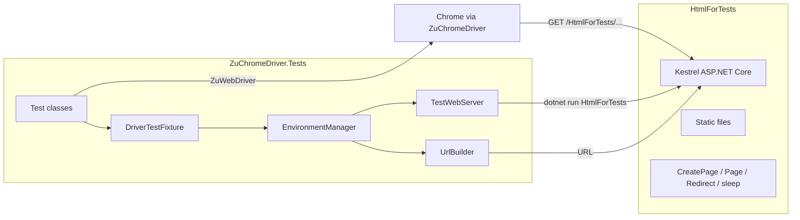

# Architecture: HtmlForTests and ZuChromeDriver.Tests

Two artifacts in the ZuChromeDriver solution: a local test web server and NUnit E2E tests against real Chrome.

## High-level relationship

- **HtmlForTests** — local HTTP server with static pages and dynamic endpoints (Selenium test page heritage)
- **ZuChromeDriver.Tests** — NUnit 4 E2E against **real Chrome** and **HtmlForTests**

## HtmlForTests

### Purpose

Predictable **`http://localhost:2310/HtmlForTests/...`** without an external Jetty server.

### Configuration

| Aspect | Value |
|--------|-------|
| SDK | `Microsoft.NET.Sdk.Web`, **net10.0** |
| URL | `http://localhost:2310` |
| Path base | `/HtmlForTests` |

### Endpoints

1. **Static files** from project root (`ServeUnknownFileTypes`)
2. **POST `CreatePage.aspx`** — JSON `{ content, dir }` → writes `temp.html` in `HtmlForTests/temp`
3. **GET `Page.aspx`** — numbered pages for navigation tests
4. **GET `Redirect.aspx`** — redirect to `resultPage.html`
5. **GET `/sleep?time=N`** — delay middleware registered **before** `UseStaticFiles`
6. Additional routes for encoding, upload, etc. as needed by test parity

Test page content follows the same relative paths as the Selenium common test HTML fixtures.

## ZuChromeDriver.Tests

### Dependencies

- NUnit 4, Test SDK, Moq
- ProjectReference → `ZuChromeDriver`

### Environment

**`EnvironmentManager`** (`Zu.ZuChromeDriver.Tests.Environment`)

- Singleton on first access
- Finds repo root by directory name **`ZuChromeDriver`**
- **`TestWebServer.Start()`** — `dotnet run` for HtmlForTests; readiness check via `simpleTest.html`
- Driver: **`new Zu.Chrome.ZuChromeDriver(chromeConfig)`** + **`new ZuWebDriver(chrome)`**

**`DriverTestFixture`**

- **`[OneTimeSetUp]`** — shared `WebDriver` from `GetCurrentDriver()`
- **`[TearDown]`** — on test failure, replaces driver with `CreateFreshDriver()` (upstream Selenium pattern)
- Precomputed URLs: `simpleTestPage`, `framesPage`, `blankPage`, …

### Test organization

- Classes named `*Test` inherit **`DriverTestFixture`**
- Test methods are **`async Task`**
- Scenarios ported from the Selenium .NET WebDriver test suite

### Type mapping from AsyncChromeDriver

| AsyncChromeDriver.Tests | ZuChromeDriver.Tests |
|-------------------------|----------------------|
| `Zu.Chrome.AsyncChromeDriver` | `Zu.Chrome.ZuChromeDriver` |
| `Zu.AsyncWebDriver.Remote.WebDriver` | `Zu.WebDriver.ZuWebDriver` |
| Namespace `AsyncChromeDriver.Tests` | `Zu.ZuChromeDriver.Tests` |
| Repo root `AsyncChromeDriver` | `ZuChromeDriver` |

Some scenarios are marked **`[Ignore]`** or **`[Explicit]`** in test source (alerts, trusted click, oversized iframe click, etc.).

## Test run flow

1. `EnvironmentManager.Instance` starts **HtmlForTests**
2. `DriverTestFixture` calls **`Connect()`** on **ZuChromeDriver**
3. Tests call `GoToUrl(UrlBuilder.WhereIs(...))`
4. TearDown / fixture end closes driver; `EnvironmentManager` destructor stops Kestrel

## Invariants

1. Port **2310** must be free; same value in HtmlForTests, `TestWebServer`, `UrlBuilder`
2. Prefix **`/HtmlForTests`** = `UsePathBase` + `UrlBuilder.Path`
3. **`CreatePage.aspx`** writes to `HtmlForTests/temp` — directory must be writable
4. Wait for tests to finish before rebuilding if `HtmlForTests.exe` is locked

## Summary

| Project | Role |
|---------|------|
| **HtmlForTests** | Kestrel: static + dynamic pages for E2E |
| **ZuChromeDriver.Tests** | NUnit: HtmlForTests + ZuChromeDriver + ZuWebDriver |

## Related documents

- [ARCHITECTURE-ZuChromeDriver-ChromeDevToolsClient.md](ARCHITECTURE-ZuChromeDriver-ChromeDevToolsClient.md)
- [ZuChromeDriver.Tests/README.md](../ZuChromeDriver.Tests/README.md) — FrameTracker and alert test notes
