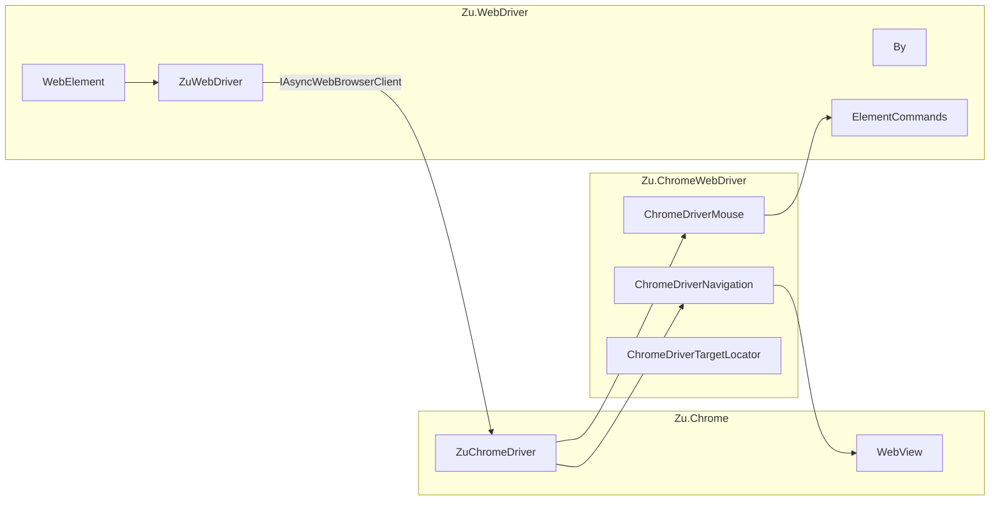

# Architecture: WebDriver and ChromeWebDriver layers

Two directories implement the portable WebDriver API and Chrome-specific browser interaction:

- **`WebDriver/`** — Selenium-like WebDriver API and atom-based element commands
- **`ChromeWebDriver/`** — Chrome implementations of browser interaction interfaces

Namespaces: **`Zu.WebDriver`**, **`Zu.ChromeWebDriver`**, partially **`Zu.WebBrowser`** (coordinates, etc.).

## Why two directories

| Layer | Chrome dependency | Examples |
|-------|-------------------|----------|
| **WebDriver** | Minimal (via `IAsyncWebBrowserClient`) | `ZuWebDriver`, `By`, `WebElement`, exceptions, Actions |
| **ChromeWebDriver** | Direct (`ZuChromeDriver`) | `ChromeDriverMouse`, `ChromeDriverCookieJar`, `ChromeDriverTargetLocator` |

Separation keeps the **WebDriver contract** distinct from **Chrome specifics**.



## ZuWebDriver — application entry point

File: `WebDriver/ZuWebDriver.cs`

- Implements **`IWebDriver`** and related finder/navigation/wait contracts
- Accepts **`IAsyncWebBrowserClient`** in constructor (typically **`ZuChromeDriver`**)
- Delegates mouse, keyboard, `Options` to the client; owns element search, implicit wait, `GoToUrl` timeouts
- Based on Selenium .NET code (see `THIRD-PARTY-NOTICES.txt`)

```csharp
var chrome = new Zu.Chrome.ZuChromeDriver(config);
await chrome.Connect();
var driver = new ZuWebDriver(chrome);
```

In AsyncChromeDriver this class was **`WebDriver`** in namespace **`Zu.AsyncWebDriver.Remote`**.

## IAsyncWebBrowserClient

File: `WebDriver/IAsyncWebBrowserClient.cs`

Aggregates browser capabilities: `Mouse`, `Keyboard`, `Navigation`, `Elements`, `TargetLocator`, `JavaScriptExecutor`, `Screenshot`, `TouchScreen`, `ActionExecutor`, `Alert`, `Options`, …

**`ZuChromeDriver`** implements this via lazy **`ChromeDriver*`** facades in `ZuChromeDriver.cs`.

## Element commands (moved from DriverCore)

| Type | File | Role |
|------|------|------|
| **`ElementCommands`** | `ElementCommands.cs` | Click, SendKeys, Clear, Focus, … |
| **`ElementUtils`** | `ElementUtils.cs` | Visibility, region, scroll, attributes via atoms |
| **`ResultValueConverter`** | `ResultValueConverter.cs` | Atom JSON → `WebPoint`, WebDriver exceptions |
| **`JsonValueHelper`** | `JsonValueHelper.cs` | Parse `Evaluate`, unwrap `value` |
| **`ElementKeys`** | `ElementKeys.cs` | `ELEMENT` vs W3C UUID |

**`ElementCommands`** takes **`ZuChromeDriver`** and calls **`WebView`**, **`ElementUtils`**, **`DevTools.Input`**.

## WebElement and finders

- **`WebElement`** — implements **`IWebElement`** with async methods (`Task<T>`). Named like Selenium's `WebElement`, but API is async-first. Coordinates via **`WebElementCoordinates`**.
- **`By`** — locator strategies (id, css, xpath, …), aligned with Selenium 4 where possible
- **`RemoteTargetLocator`** — `switchTo().frame()`, windows, alerts

**`WebDriver/Extensions/`** — `Task*Extensions` for ergonomic `await` on `IWebDriver` / `IWebElement`. No blocking `SyncWrapper` (unlike AsyncChromeDriver).

## ChromeWebDriver — Chrome facades

One class per interaction interface:

| Class | Interface | Dependencies |
|-------|-----------|--------------|
| `ChromeDriverMouse` | `IMouse` | `ElementCommands`, `WebView`, Input CDP |
| `ChromeDriverKeyboard` | `IKeyboard` | `DispatchKeyEvents` |
| `ChromeDriverNavigation` | `INavigation` | `WindowCommands` |
| `ChromeDriverElements` | `IElements` | find, element properties |
| `ChromeDriverTargetLocator` | `ITargetLocator` | frames, windows, `SwitchDevToolsToTarget` |
| `ChromeDriverJavaScriptExecutor` | `IJavaScriptExecutor` | execute / async, JSON unwrap |
| `ChromeDriverCookieJar` | cookies | Network / Runtime + `LastNavigatedUrl` |
| `ChromeDriverScreenshot` | `ITakesScreenshot` | `Page.captureScreenshot` |
| `ChromeDriverTouchScreen` | `ITouchScreen` | `Input.dispatchTouchEvent` |
| `ChromeDriverActionExecutor` | W3C Actions | pointer/touch sequences |
| `ChromeDriverLogs` | logs | browser log buffer via CDP `Log` |
| `ChromeDriverOptions` / `ChromeDriverTimeouts` | capabilities, timeouts | `ChromeDriverConfig` |

## Exceptions and types

- **`WebDriver/Exceptions/`** — `NoSuchElementException`, `StaleElementReferenceException`, `WebDriverTimeoutException`, …
- **`WebDriver/BasicTypes/`** — `WebPoint`, `Cookie`, `Keys`, `LogEntry`, W3C Actions
- **`WebDriver/Interactions/`** — action builders (click chains, touch)

Atom status → exception mapping: **`ResultValueConverter.ToWebBrowserException`** (statuses 7, 17, 28, …).

## Related documents

- [ARCHITECTURE-DriverCore.md](ARCHITECTURE-DriverCore.md)
- [ARCHITECTURE-ZuChromeDriver-ChromeDevToolsClient.md](ARCHITECTURE-ZuChromeDriver-ChromeDevToolsClient.md)
- [COMPARISON-WebDriver-Selenium-DotNet.md](COMPARISON-WebDriver-Selenium-DotNet.md)
