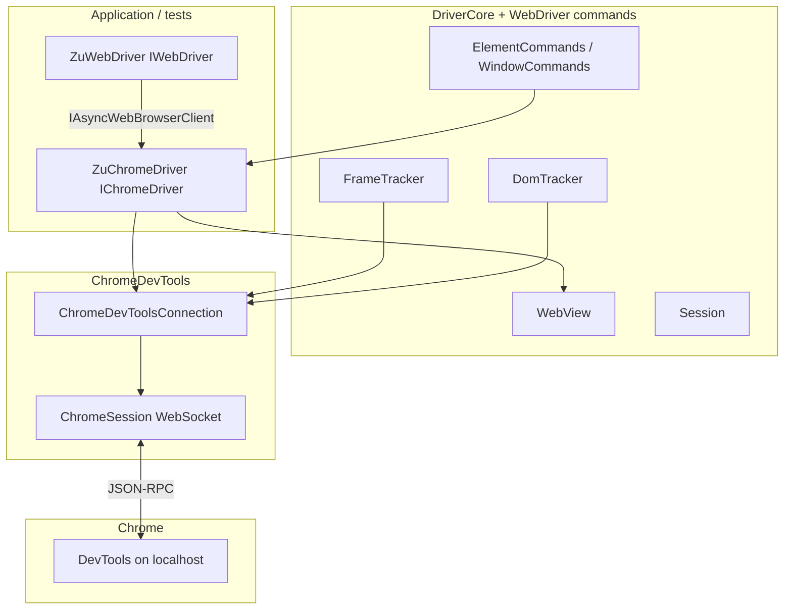
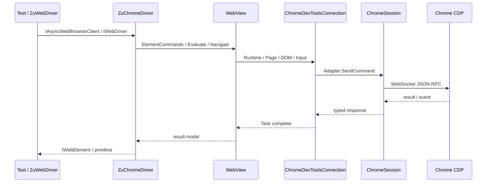

# Architecture: ZuChromeDriver and ChromeDevToolsClient

Two related .NET projects in the ZuChromeDriver solution: **`ChromeDevToolsClient`** (CDP transport over WebSocket) and **`ZuChromeDriver`** (async Chrome automation with a Selenium-like facade).

## Purpose vs classic ChromeDriver

**Classic ChromeDriver** is a separate binary that speaks CDP to the browser and HTTP WebDriver to tests.

**ZuChromeDriver** is a **direct in-process CDP client**: a long-lived WebSocket to a Chrome tab (`page`), with commands and events in Chrome DevTools format. WebDriver compatibility is provided by **`ZuWebDriver`** on top of **`IAsyncWebBrowserClient`**, implemented by **`ZuChromeDriver`**.

## Projects and dependencies

| Project | Assembly / package | Dependencies |
|---------|-------------------|--------------|
| **ChromeDevToolsClient** | `Zu.ChromeDevToolsClient`, net10.0 | `ClientWebSocket`, `System.Text.Json` |
| **ZuChromeDriver** | library, `RootNamespace` = `Zu` | ProjectReference → ChromeDevToolsClient |

Unlike AsyncChromeDriver, ZuChromeDriver has **no CDP WebSocket proxy** (`ChromeWSProxyConfig` removed). `GetBrowserDevToolsUrl` builds the inspector URL from `ChromeSession.EndpointAddress`.

## ChromeDevToolsClient — transport and generated protocol

### Role

Single entry point to the browser once the **WebSocket URL** of a session is known (from `http://127.0.0.1:<port>/json`).

### ChromeSession

- Connects via **WebSocket** (`ClientWebSocket`)
- Sends JSON-RPC commands (`id`, `method`, `params`) and matches responses by `id`
- Receives events (`method` without matching `id`) and dispatches to subscribers
- Default command timeout: 5 seconds (`CommandTimeout`)
- Raises **`DevToolsEvent`** for raw notifications

Partial class extended by **`generated/ChromeSession_Domains.cs`**: lazy domain adapters (`Session.DOM`, `Session.Page`, `Session.Runtime`, …).

### Boundary

`ChromeDevToolsClient` does **not** launch Chrome or select a tab — only connects to a known endpoint and exchanges CDP messages. Types are generated by **ChromeDevToolsClientGenerator**.

## ZuChromeDriver — browser lifecycle

### Root type

- **Class:** `Zu.Chrome.ZuChromeDriver` — `ZuChromeDriver/ZuChromeDriver.cs`
- **Interface:** `IChromeDriver` : `IAsyncWebBrowserClient`
- **Chrome facades:** `ChromeWebDriver/` — `ChromeDriverMouse`, `ChromeDriverNavigation`, …

| Field | Purpose |
|-------|---------|
| **`ChromeDevToolsConnection DevTools`** | Wrapper over `ChromeSession` + domain shortcuts |
| **`Session`** | WebDriver session state (not `ChromeSession`) |
| **`WebView`**, **`FrameTracker`**, **`DomTracker`** | Page bridge, iframe contexts, node↔frame |
| **`ElementCommands`**, **`ElementUtils`**, **`WindowCommands`** | Element/window commands (`Zu.WebDriver`) |

### Connect()

1. Launch Chrome with `--remote-debugging-port` if needed (`ChromeProfilesWorker`, `ChromeDriverConfig`)
2. **`DevTools.Connect()`**: `GET /json` → first `Type == "page"` target → `ChromeSession(webSocketDebuggerUrl)`
3. Subscribe to **`DevToolsEvent`**
4. **`EnableConfiguredSessionFeaturesAsync`**: per config flags — `FrameTracker`, `DomTracker`, browser log capture

Connection retries: up to 5 on Windows, up to 50 on other OS, 200 ms delay.

### SwitchDevToolsToTarget

**`SwitchDevToolsToTarget(targetId)`** — `ChromeDevToolsConnection.ReconnectToTarget`, clears frame stack, re-enables trackers. Switches CDP WebSocket to another tab without restarting Chrome.

### ChromeDevToolsConnection

- Stores **`Port`** and **`ChromeSession Session`**
- **`Connect()`** — picks a `page` target from `/json`
- Exposes domain properties at top level (`DOM`, `Page`, `Runtime`, …)
- **`ReconnectToTarget`** — change WebSocket without restarting Chrome

Implementation: `ZuChromeDriver/ChromeDevTools/`.

### Configuration

**`ChromeDriverConfig`** flags:

| Flag | Default | Purpose |
|------|---------|---------|
| `EnableFrameTrackerOnConnect` | `false` | iframe contexts, JS dialog tracking |
| `EnableDomTrackerOnConnect` | `false` | nodeId ↔ frameId mapping |
| `EnableBrowserLogCaptureOnConnect` | per config | CDP `Log` domain |
| `DoNotOpenChromeProfile` | — | attach to existing Chrome |
| `DoOpenBrowserDevTools` | `false` | open inspector UI in separate session |

Also: port, profile directory, log preferences, `DisablePopupBlocking`.

**`ChromeProfilesWorker`** starts Chrome; **`ProcessWithJobObject`** keeps child process on Windows.

### Nested browser DevTools

**`OpenBrowserDevTools()`** creates a second `ZuChromeDriver` and opens the inspector UI URL — for debugging CDP without recursive `DoOpenBrowserDevTools`.

## Request flow

## Ports and processes

- Chrome: `--remote-debugging-port=<Port>` (default random ~11000–13000)
- HTTP `http://127.0.0.1:<Port>/json` — target list and WebSocket URLs
- Test server: **HtmlForTests** on port **2310**, path base **`/HtmlForTests`**

## Directory map

**ZuChromeDriver**

| Path | Contents |
|------|----------|
| `ZuChromeDriver.cs` | Root driver, `CreateDriverCore`, `Connect` |
| `IChromeDriver.cs` | Chrome driver contract |
| `ChromeDevTools/` | CDP facade, config, Chrome launch |
| `DriverCore/` | Session, trackers, WebView, atoms |
| `WebDriver/` | ZuWebDriver, elements, commands |
| `ChromeWebDriver/` | `IAsyncWebBrowserClient` implementations |

**ChromeDevToolsClient**

- `ChromeSession*.cs`, `generated/**`, `ChromeDevToolsJsonSerializerOptions.cs`

## Related documents

- [ARCHITECTURE-DriverCore.md](ARCHITECTURE-DriverCore.md)
- [ARCHITECTURE-WebDriver-Layer.md](ARCHITECTURE-WebDriver-Layer.md)
