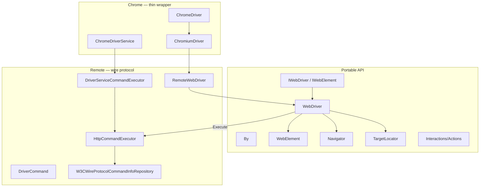
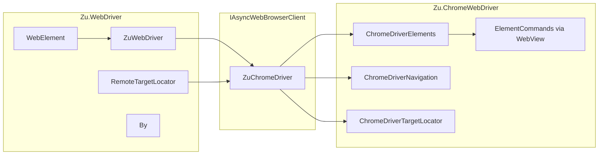

# Comparison: ZuChromeDriver WebDriver layer vs Selenium .NET

Comparison of **`WebDriver/`** and **`ChromeWebDriver/`** in ZuChromeDriver with the official Selenium .NET WebDriver package (`OpenQA.Selenium`).

## Summary

| Aspect | Selenium .NET | ZuChromeDriver |
|--------|---------------|----------------|
| Transport | W3C WebDriver over HTTP (`ICommandExecutor`) | Chrome DevTools Protocol directly |
| API model | Sync-first (`string Url`, `void Quit()`) | Async-first (`Task<T>`, `CancellationToken`) |
| Entry point | `WebDriver` → `RemoteWebDriver` / `ChromeDriver` | `ZuWebDriver` + `IAsyncWebBrowserClient` |
| Chrome specifics | Inside `ChromiumDriver` / wire commands | Separate `ChromeWebDriver/ChromeDriver*` |
| Element find | `Execute(FindElement, …)` → HTTP | Atoms via `WebView.CallFunction` |
| Code origin | Original Apache 2.0 | Fork/adaptation of Selenium + Chromedriver atoms |

ZuChromeDriver **preserves the shape** of the Selenium API (`IWebDriver`, `By`, `WebElement`, Actions, exceptions) but **changes transport and execution**: in-process CDP instead of JSON-over-HTTP to `chromedriver.exe`.

> **Class names:** Zu uses **`WebElement`** (same name as Selenium) but with an **async** `IWebElement` contract (`Task<T>`), not sync properties on `OpenQA.Selenium.WebElement`.

## Selenium .NET structure



Key Selenium types: `WebDriver`, `IWebDriver`, `RemoteWebDriver`, `HttpCommandExecutor`, `ChromeDriver`, `ChromiumDriver`, `By`, `TargetLocator`, `Interactions/`.

## ZuChromeDriver mirror

| Role | ZuChromeDriver |
|------|----------------|
| Base driver (API) | `WebDriver/ZuWebDriver.cs` |
| Browser contract | `WebDriver/IAsyncWebBrowserClient.cs` |
| Chrome implementation | `ZuChromeDriver.cs` |
| Chrome facades | `ChromeWebDriver/ChromeDriver*.cs` |
| DOM element | `WebDriver/WebElement.cs` |
| Coordinates | `WebDriver/WebElementCoordinates.cs` |
| Locators | `WebDriver/By.cs` |
| SwitchTo | `WebDriver/RemoteTargetLocator.cs` + `ChromeDriverTargetLocator` |
| Element commands | `WebDriver/ElementCommands.cs` |
| Atom utilities | `WebDriver/ElementUtils.cs` |
| JSON → types/errors | `WebDriver/ResultValueConverter.cs` |
| Async extensions | `WebDriver/Extensions/Task*.cs` |

## Architectural comparison

### 1. Entry point and layer split

**Selenium:** inheritance stack `ChromeDriver` → `ChromiumDriver` → `WebDriver`. One class owns both public API and `ICommandExecutor`.

**ZuChromeDriver:** explicit split:

```csharp
var chrome = new Zu.Chrome.ZuChromeDriver(config);
await chrome.Connect();
var driver = new ZuWebDriver(chrome);  // chrome : IAsyncWebBrowserClient
```

- **`ZuWebDriver`** — test-facing API (like `RemoteWebDriver` role), no HTTP
- **`ZuChromeDriver`** — like `ChromeDriver` + chromedriver process, but in-process CDP
- **`ChromeWebDriver/ChromeDriver*`** — delegates (like internal `Navigator`, `TargetLocator` in Selenium)



### 2. Command transport

**Selenium** central pattern: `WebDriver.Execute(driverCommand, parameters)` → `HttpCommandExecutor` → HTTP → chromedriver → browser.

**ZuChromeDriver:** direct CDP and atoms — `browserClient.Elements.FindElement` → `WindowCommands` → `WebView.CallFunction(FIND_ELEMENT)`.

| Selenium | ZuChromeDriver |
|----------|----------------|
| `DriverCommand.FindElement` | strategy + expr → FIND_ELEMENT atom |
| `Response` + `WebDriverResult` | `JsonNode` + `ResultValueConverter` |
| W3C element UUID | `ElementKeys` / `Session.GetElementKey()` |
| `HttpCommandExecutor` | `ChromeDevToolsConnection` + `WebView` |
| `ChromeDriverService` + exe | `ZuChromeDriver.Connect()` |

### 3. Sync vs async

| | Selenium `IWebElement` | Zu `WebElement` |
|--|------------------------|-----------------|
| TagName | `string TagName { get; }` | `Task<string> TagName(CancellationToken)` |
| Click | `void Click()` | `Task Click(CancellationToken)` |
| Coordinates | `ElementCoordinates` | `WebElementCoordinates` |

Zu adds **`WebDriver/Extensions/`** for ergonomic `await`. No blocking `SyncWrapper`.

### 4. Navigation

**Selenium `Navigator`** — thin `Execute(GoBack/GoForward/Get/Refresh)`.

**Zu `ChromeDriverNavigation`** — calls `WindowCommands` and `WebView` directly; after `Refresh` waits for document ready-state and same-origin frames — closer to C++ Chromedriver than fire-and-forget wire commands.

### 5. TargetLocator / SwitchTo

**Selenium:** internal `TargetLocator` — sync `Frame`, `Window`, `Alert` via `driver.Execute`.

**Zu:** two levels:
- **`RemoteTargetLocator`** — `ZuWebDriver` API, async
- **`ChromeDriverTargetLocator`** — CDP/target/frame tracking, `SwitchDevToolsToTarget`

Alert handling checks `FrameTracker.TryGetBlockingJavaScriptDialog` — Chrome-specific.

### 6. Chrome-specific features

**Selenium `ChromeDriver`** — extra HTTP commands (`executeCdpCommand`, …) over subprocess `chromedriver.exe`. Most `IWebDriver` ops still use wire protocol.

**Zu** — full in-process implementation:

| Interface | Selenium | Zu |
|-----------|----------|-----|
| `INavigation` | HTTP | `ChromeDriverNavigation` |
| `IMouse` | HTTP + Actions | `ChromeDriverMouse` → `Input.dispatchMouseEvent` |
| `IKeyboard` | HTTP | `ChromeDriverKeyboard` → `DispatchKeyEvents` |
| Find | HTTP | `ChromeDriverElements` → atoms |
| Cookies | HTTP | `ChromeDriverCookieJar` → Network/Runtime CDP |
| Screenshot | HTTP | `ChromeDriverScreenshot` → `Page.captureScreenshot` |
| W3C Actions | HTTP | `ChromeDriverActionExecutor` |
| Logs | HTTP / BiDi | `ChromeDriverLogs` → CDP `Log` |

### 7. Atoms

Zu **`ElementCommands`**, **`ElementUtils`**, **`ResultValueConverter`** live in `WebDriver/` but execute via `WebView` and chromedriver atoms. Click uses `Atoms.CLICK` and `ResultValueConverter.ToWebBrowserException`.

Selenium .NET has **no atoms in the binding** — they run inside native chromedriver; the client sees HTTP error codes only.

### 8. Implicit wait

**Selenium:** server-side polling (chromedriver) or client `WebDriverWait`.

**Zu:** polling in **`ChromeDriverElements.FindElement`** — loop with `Task.Delay(50)`, timeout from argument or `Options.Timeouts.GetImplicitWait()`.

Zu also supports **`notElementId`** (find element different from a given id).

### 9. Exceptions

| Selenium | Zu |
|----------|-----|
| `WebDriverException` + HTTP status | `WebBrowserException` + atom status |
| `OpenQA.Selenium.*` | `Zu.WebDriver.Exceptions.*` |

### 10. Capabilities and session

| Selenium | Zu |
|----------|-----|
| `ICapabilities`, `StartSession` | `ChromeDriverConfig`, `Connect()` |
| `SessionId` on every HTTP command | `Session` (frame stack, timeouts, element key mode) |
| Grid / Remote URL | Not supported (direct Chrome only) |

## Class correspondence table

| Selenium .NET | ZuChromeDriver | Note |
|---------------|----------------|------|
| `WebDriver` | `ZuWebDriver` + `ZuChromeDriver` | Split API and engine |
| `RemoteWebDriver` | `ZuWebDriver` | No HTTP remote |
| `HttpCommandExecutor` | — | Replaced by CDP |
| `ChromeDriver` | `ZuChromeDriver` | In-process CDP |
| `ChromiumDriver` | `DriverCore` + `ChromeWebDriver` | No single base class |
| `WebElement` | `WebElement` | Same name, async vs sync |
| `ElementCoordinates` | `WebElementCoordinates` | |
| `Navigator` | `ChromeDriverNavigation` | |
| `TargetLocator` | `RemoteTargetLocator` + `ChromeDriverTargetLocator` | |
| `By` | `By` | |
| `DriverCommand.*` | `WindowCommands`, `ElementCommands`, CDP | |
| `Response` | `JsonNode` | |
| `ICommandExecutor` | `IAsyncWebBrowserClient` | Different semantics |
| `Interactions/*` | `WebDriver/Interactions/*` | Ported from Selenium |

## What Zu took from Selenium

- `IWebDriver`, `IWebElement`, finder interfaces — signatures and docs
- `By` — locator strategies, W3C compliance, CSS escape
- `ZuWebDriver` / `WebElement` — bulk finder methods, W3C comments
- `RemoteTargetLocator` — `Frame`/`Window`/`Alert` structure
- Exceptions, `Cookie`, `Keys`, W3C Actions model
- `DefaultCommandTimeout = 60s` from `RemoteWebDriver`

## Design differences

1. **No wire protocol** — cannot connect to Selenium Grid or external `chromedriver.exe` without a new adapter
2. **No `RemoteWebDriver(Uri, capabilities)`** — different launch model (`Connect` + config)
3. **Async-only contract** — migration from Selenium .NET requires `await`
4. **`ElementCommands` in WebDriver depends on Chrome** — portable layer is not fully isolated
5. **Zu extensions** — `FindElementOrDefault`, `notElementId`, `GoToUrlTimeoutMs`, `CloseSync`
6. **Homonym `WebElement`** — always check namespace: `OpenQA.Selenium.WebElement` vs `Zu.WebDriver.WebElement`

## Data flow: one Click

### Selenium .NET

```
Test → driver.FindElement(By.Id("x"))
     → WebDriver.Execute(FindElement)
     → HttpCommandExecutor → POST /session/{id}/element
     → chromedriver.exe → atom → Chrome
Test → element.Click()
     → WebElement.Execute(ClickElement)
     → HTTP POST /session/{id}/element/{id}/click
     → chromedriver → CLICK atom
```

### ZuChromeDriver

```
Test → await driver.FindElement(By.Id("x"))
     → ZuWebDriver → browserClient.Elements.FindElement
     → WindowCommands → WebView.CallFunction(FIND_ELEMENT atom)
Test → await element.Click()
     → ElementCommands.ClickElement
     → WebView.CallFunction(CLICK atom) + optional Input CDP fallback
     → ResultValueConverter (errors)
```

## Related documents

- [ARCHITECTURE-WebDriver-Layer.md](ARCHITECTURE-WebDriver-Layer.md)
- [ARCHITECTURE-DriverCore.md](ARCHITECTURE-DriverCore.md)
