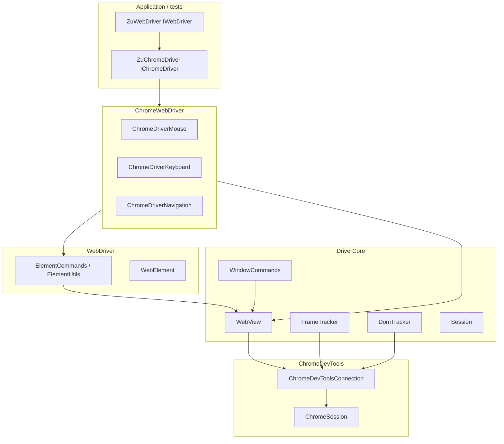

# ZuChromeDriver — Architecture Documentation

**ZuChromeDriver** is an async Chrome automation library for .NET. It connects directly to **Chrome DevTools Protocol (CDP)** without a separate `chromedriver` binary and exposes a **Selenium-like WebDriver API** on top.

These documents describe layers, data flows, and extension points for developers working on or integrating with the library.

## Solution layout

```
ZuChromeDriver.slnx
├── ZuChromeDriver/          # Main library (net10.0)
├── ChromeDevToolsClient/    # NuGet Zu.ChromeDevToolsClient — CDP transport
├── ChromeDevToolsClientGenerator/
├── HtmlForTests/            # Kestrel test page host
└── ZuChromeDriver.Tests/    # NUnit E2E against Chrome + HtmlForTests
```

## Typical usage

```csharp
var chrome = new Zu.Chrome.ZuChromeDriver(chromeConfig);
await chrome.Connect();
var driver = new ZuWebDriver(chrome);
await driver.GoToUrl(url);
```

## Layer diagram



## Two "session" types

| Name | Namespace | Role |
|------|-----------|------|
| **Session** (WebDriver) | `Zu.Chrome.DriverCore` | Frame stack, W3C element keys, timeouts, mouse position |
| **ChromeSession** (CDP) | `Zu.ChromeDevTools` | WebSocket, JSON-RPC, domain adapters |

Keep these distinct when reading or refactoring code.

## Evolution from AsyncChromeDriver

ZuChromeDriver continues the AsyncChromeDriver project with renamed types and a cleaner layout:

| AsyncChromeDriver | ZuChromeDriver |
|-------------------|----------------|
| `AsyncChromeDriver` | `ZuChromeDriver` |
| `IAsyncChromeDriver` | `IChromeDriver` |
| `AsyncWebDriver.Remote.WebDriver` | `ZuWebDriver` |
| `AsyncWebElement` | `WebElement` |
| `AsyncWebDriver/` folder | `WebDriver/` |
| `IAsyncWebBrowserClient/*` | `ChromeWebDriver/ChromeDriver*` |
| `ElementCommands` in `DriverCore/` | `ElementCommands` in `WebDriver/` |
| CDP WebSocket proxy | Removed |

## Documents

| File | Contents |
|------|----------|
| [ARCHITECTURE-ZuChromeDriver-ChromeDevToolsClient.md](ARCHITECTURE-ZuChromeDriver-ChromeDevToolsClient.md) | ZuChromeDriver + ChromeDevToolsClient stack, lifecycle, CDP |
| [ARCHITECTURE-DriverCore.md](ARCHITECTURE-DriverCore.md) | Session, frames, DOM, atoms, WebView |
| [ARCHITECTURE-WebDriver-Layer.md](ARCHITECTURE-WebDriver-Layer.md) | ZuWebDriver, element commands, ChromeWebDriver facades |
| [ARCHITECTURE-HtmlForTests-ZuChromeDriver.Tests.md](ARCHITECTURE-HtmlForTests-ZuChromeDriver.Tests.md) | HtmlForTests and E2E test harness |
| [COMPARISON-WebDriver-Selenium-DotNet.md](COMPARISON-WebDriver-Selenium-DotNet.md) | Architecture comparison with Selenium .NET |
